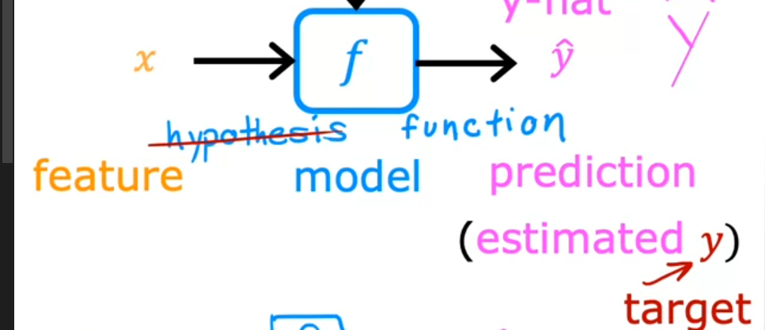
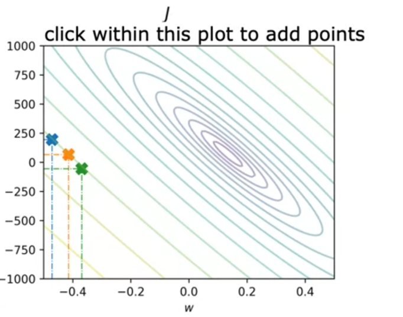
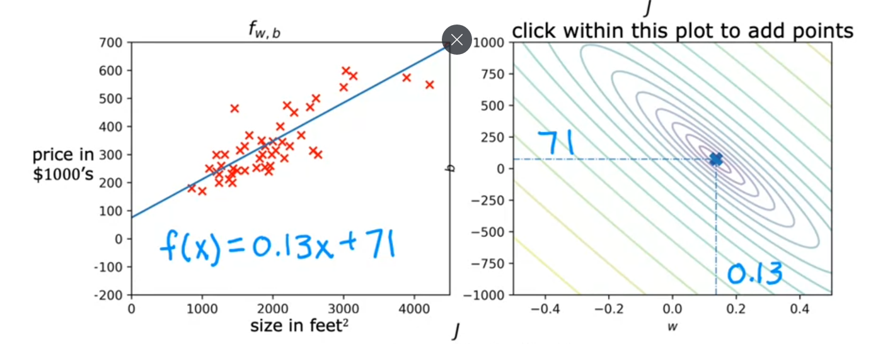
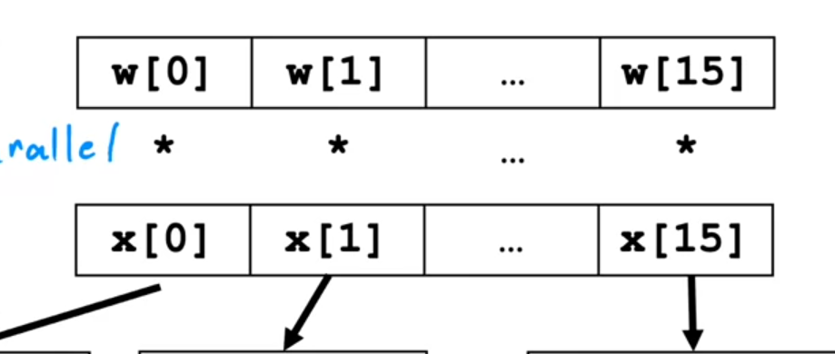
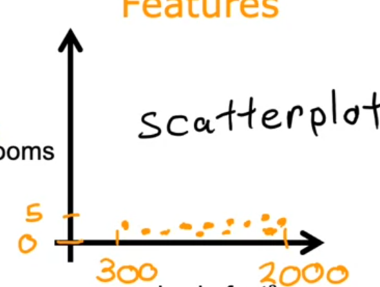
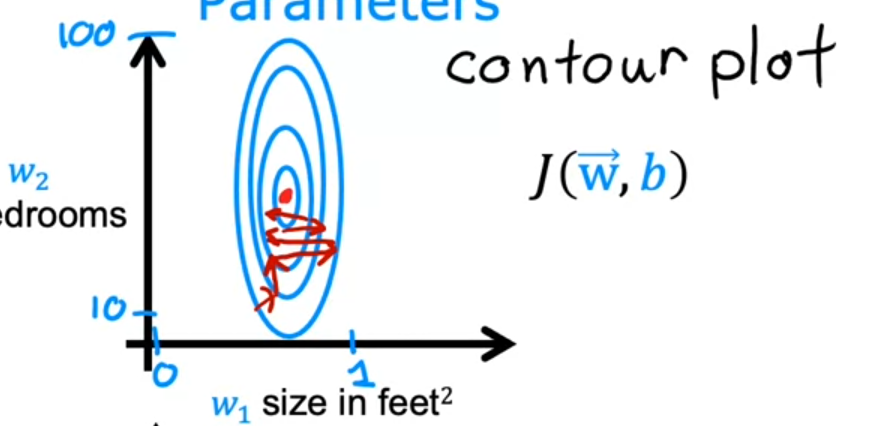
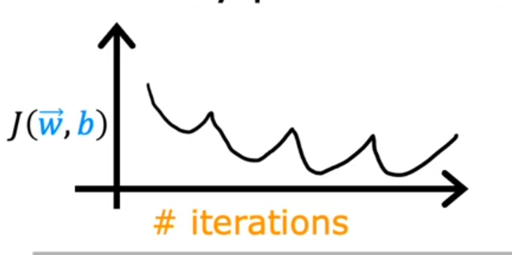
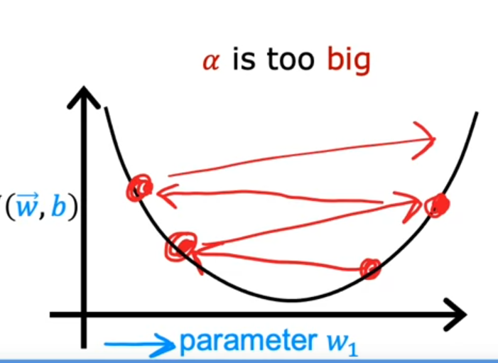

# Machine Learning

>Field of study that gives computers the ability to learn withut being explicitly programmed. 
-Arthur Samuel 

+ Supervised Learning
The purpose of this way of learning is to given certain inputs, take them to obtain an output through algorithms. "Learn from right answers"
    1. Regression: Predict a number through infinitely many possible outputs. 
    2. Classification: predict discrete outputs (classes-categories), the most common has 2 possible outputs: 1 or 0. 
+ Unsupervised Learning
The data is given, but yet not classificated or labeled. The objective is to find something interesting in unlabeled data.  ** Algorithm has to find structure in the data **.

    1. Clustering (ex: Google News,DNA microarray): groups of data elements according to their similarity features.

*Steps*

    + Dimensionality Reduction: compress data using 
    + Dimensionality Reduction: compress data
    + Anomaly Detection: Find unusual 

+ Recommender systems
+ Reinforcement learning

___

    <b>
        <h1>
        Supervised Learning
        </h1>
    </b>

Training set -> Learning Algorithm -> Hypothesis function  (model)

Univariate linear regression 

Multivariate regression

<strong>

Linear Regression

</strong>

### Cost function 

$ J(w,b) = \frac{1}{2m} \sum _{i=1} ^{m} (f_{w,b}(x^{i})-y^{(i)})^2 $

$f_{w,b}(x^{(i)})=w x^{i} + b$

### Cost function intuiton

It's choosed a "w,b" such that minimizes J(w,b)-> Error function. 

+ contour graph

It shows the center points that have the same value J, but different values on w,b.
It takes horizontal sizes, those are the elipses.

The error minimizes when the cost function is near or in the global minimum.
The cost function can be convex, which indicates that the cost function has a global mininum.
___

### Multiple features

It not the same that multivariable regression 

$ f_{\vec{w},b}(x)=w_1 x_1 + w_2 x_2 + w_3 x_3 + w_n x_n + b... = \vec{w} \cdot \vec{x} +b $

### Vectorization

$\vec{w}=[w_{1} w_{2} w_{3}]$ 

In python (simpler,faster) with numpy uses parallel hardware:

    f= np.dot(w,x) + b

### Gradient descent in multiple features (n)
$ w_{j} = w_{j} - \alpha \frac{1}{m} \sum _{i=1} ^{m} (f_{\vec{w},b}(\vec{x}^{(i)})-y^{(i)})x_{j}^{(i)} $

$ b = b - \alpha \frac{1}{m} \sum _{i=1} ^{m} (f_{\vec{w},b}(\vec{x}^{(i)})-y^{(i)})x_{j}^{(i)} $

An alternative to gradient descent:

* Normal equation : only for linear regression, slow.

___

### Feature size and gradient descent

Features

Parameters (Contour graph)

<strong>Feature Scaling</strong>

* Max Normalization
$x = \frac{x}{max(x)}$

* Mean Normalization
$x =\frac{x - \mu}{max(x)-min(x)}$

* Z-score Normalization
$x=\frac{x-\mu}{\sigma}$

<strong>Checking descent for convergance</strong>

Objective function: $min_{w,b}  J(\vec{w},b)$

When $\alpha$ is tiny :

When $\alpha$ is big :

Recommended method : increase x3, then by decade.

<strong>Feature Engineering</strong>

$f_{\vec{w},b}=w_{1}x_{1}+w_{2}x_{2}+w_{3}x_{3}$

Creating a new variable $x_{3}=x_{1}x_{2}$

___

<strong>Logarithmic Regression</strong>

### Cost Function

$ 
    f_{(\vec{w},b)} =\frac{1}{1+e^{-(\vec{w} \cdot \vec{x} + b)}}
$
The cost function from this logistic function is not convex (multiple minimums), hence it could not be used.

$J(\vec{w},b) =\frac{1}{m} \sum _{i=1} ^{m} (f(\vec{x^{(i)}})-y^{(i)})^2$

Logistic Loss function:

$L\left(f_{\vec{w},b}\left(\vec{x}^{(i)}\right), y^{(i)}\right) = \begin{cases}
-\log\left(f_{\vec{w},b}\left(\vec{x}^{(i)}\right)\right) & \text{if } y^{(i)} = 1 \\
-\log\left(1-f_{\vec{w},b}\left(\vec{x}^{(i)}\right)\right) & \text{if } y^{(i)} = 0
\end{cases}$

* Clasification 

* Regressions

The cost previous cost function is not linear, the simplified cost function does:

$L(f_{\vec{w},b}(\vec{x}^{(i)}), y^{(i)}) = -y^{(i)} \log(f_{\vec{w},b}(\vec{x}^{(i)})) - (1 - y^{(i)}) \log(1 - f_{\vec{w},b}(\vec{x}^{(i)}))$

$ J(\vec{w}, b) = \frac{1}{m} \sum_{i=1}^{m} \left[ L\left(f_{\vec{w},b}\left(\vec{x}^{(i)}\right), y^{(i)}\right) \right] $

### Gradient descent for logistic regression

Simultaneous updates like the linear regression, same concepts:

* Gradient Descent
* Vectorized Implementation
* Feature scaling

### Problems

* Overfitting

* Underfitting

Through Regulatization is possible to reduce the size of parameters $w_j$:

$wrong: f(x)=28x - 385 x^{2}+39x^{3}-174x^{4}+100 (big values for w_{j})$

$good: f(x)= 13x-0.23x^{2} + 0.00014x^{3}-0.001 x^{4} +10 (small values for w_{j})$

- Solutions to overfitting:

    1. collect more data, select features, reduce size of parameters. When regularizing, a terms are added to the cost function:

    2. To regularize w terms, the term is $\frac{\lambda}{2m} \sum _{j=1}^{n} w_{j}$

        - To regularize b , the term is $\frac{\lambda}{2m} b^{2}$

        - being $\lambda >0$, it means the relative "trade-off".

    ### Gradient descent with regularization
    
    The boxed part is new:
    

    $ w_{j}=\boxed{ w_{j} - \alpha \frac{\lambda w_{j}}{m} }- \alpha \frac{1}{m} \sum _{i=1} ^{m}(f_{\vec{b},b}(\vec{x}^{(i)}-y^{(i)})) x_{j}^{(i)} $

    ___

    <b>
        <h1>
        Advanced Learning Algorithms
        </h1>
    </b>

## Neuronal Networks

It began with algorithms to mimic the brain (1980-1990), then the resurgence in 2005 with speech-> images -> text (NLP). 

Linear and Logarithmic regression wheren't able to train big amount of data. 

GPUs (Faster computer processors) are used to train extensive data.  

### Demand Preduction

With an activation function, given an input is possible to have an output. Example:

    Inputs: price, shipping cost, marketing, material
    Output: probability of being a top seller

affordability, awareness, and perceived quality are activations, same as the final output. These activations are modeled as vectors.

*Example : Face Recognition, Car Recognition*

When there are classification problems, the activation is used at the end of the neuronal network.

$a_{1} = g(\vec{w_{1}} \cdot x + b_1)$

...

$a_{n} = g(\vec{w_{n}} \cdot x + b_n)$

Example:

$a_{2}^{[3]}=g(\vec{w_{2}}^{[3]} \cdot \vec{a_2}^{[2]} +b_{2}^{[3]} )$

...

$a_{j}^{[l]}=g(\vec{w_{j}}^{[l]} \cdot \vec{a_j}^{[l-1]} +b_{j}^{[l]} )$

* Propagation

    - Forward

    - Backward

* Example with Tensorflow

        x = np.array([200, 17])
        layer_1= Dense(units=3, activation ='sigmoid') 
        a1=layer_1(x)
        layer_2= Dense(units=1, activation ='sigmoid') 
        a2=layer_2(x)
        model= Sequential([layer_1,layer_2])
        #testing
        x = np.array([ [200, 17],[120,5],[425,20],[2121,18]])
        y=np.array([1,0,0,1])
        model.fit(x,y)

        w1_1 = np.array()
        w2_1 

### Implementation of forward propagation
Manual: with numpy implementation

    def dense(a_in,W,b):
        units=W.shape[1]
        a_out=np.zeros(units)
        for j in range(units):
            w = W[:,j]
            z = np.dot(w,a_in) + b[j]
            a_out[j]= g(z)
        return a_out
    def sequential(x):
        a1=dense(x,W1,b1)
        a2=dense(a1,W1,b1)
        a3=dense(a2,W1,b1)
        a4=dense(a3,W1,b1)
        f_x=a4
        return f_x

### Speculations on AGI (Artifitial General Intelligence)

AI

- ANI (Artificial narrow intelligence): Smart speaker, seld-driving car...

- AGI (Arificial general intelligence): Do anything a human can do

The "One learning algorithm" hypothesis : given a certain stimulus, the proccesor can learn and adapt it according to the environment it is in.

Sensor representations: seeing with the tongue, human echolocation, haptic belt.

### Vectorization

    x=np.array([[200,17]])
    W=np.array([[1,-3,5],[-2,4,-6]])
    B=np.array([[-1,1,2]])

    def dense(A_in,W,B):
        Z = np.matmul(A_in,W)+B
        A_out = g(Z)
        return A_out

Matrix multiplication code:

    A = np.array([[1,-1,0.1],[2,-2,0.2]])
    W = np.array([[3, 5, 7, 9],[4, 6 , 8 ,0]])
    B = np.array([-1,1,2]) 
    Z = np.matmul(AT,W)
    Z = AT @ W

### Training NN with TF

    import tensorflow as tf
    from tensorflow.keras import Sequential
    from tensorflow.keras.layers import Dense
    from tensorflow.keras.losses import BinaryCrossentropy

    model=Sequential(Dense(...),Dense(...),Dense(...))
    model.compile(loss=BinaryCrossentropy())
    model.fit(X,Y,epochs=100)

    #epochs: number of steps in gradient descent

### Model Training Steps

1. Specify the function f -> $f(x,y) model 
2. Specify loss and cost -> J(W,B), model.compile(loss=MeanSquaredError - BinaryCorssentropy())
3. Train on data to min J : GRADIENT DESCENT! -> model.fit(X,y,epochs=100)
  
+ The logistic loss is known in tensorflow as BinaryCrossentropy().

+ The minimization applies on the cost function (overall function), which is the average of the m training samples.

+ In Tensorflow there are different kinds of loss functions (error functions).

- Activation Functions:

    -Linear Activation functions $g(z)=w*z +b $ -/+

    -Sigmoids: $g(z)=1/(1+e^{z})$ 0/1
 
    -ReLU : $g(z)=max(0,z)$ 0/+

    -SoftMax 

flat activation functions -> slow when GD is used
not flat activation functions > faster

It's recommended in the first layers, use the relu, then a soft AF. 

### Multiclass Classification Problem

### Generalization of Logistic Regression (Soft Max Regression)

+ Logistic Regression

$a_1 = g(z)= \frac{1}{1+ e^{-z}}= P( y=1 |\vec{x})$

$a_2 = 1 - a_{1}=P(y=0 | \vec{x})$

+ Softmax Regression  (Multiclass classification)

$ z_1 = \vec{w_1} \cdot \vec{x} + \vec{b_1}$

$ z_2 = \vec{w_2} \cdot \vec{x} + \vec{b_2}$

$ z_3 = \vec{w_3} \cdot \vec{x} + \vec{b_3}$

$ z_4 = \vec{w_4} \cdot \vec{x} + \vec{b_4}$

$a_{j}=\frac{e^{z_j}}{\sum _{k=1} ^{N} e^{z_k}}=P(y=j|\vec{x})$

$\text{Cross-entropy loss} \quad loss(a_1, ..., a_N, y) = \begin{cases}
-\log a_1 & \text{if } y = 1 \\
-\log a_2 & \text{if } y = 2 \\
\vdots \\
-\log a_N & \text{if } y = N
\end{cases}$

**Implementation**

    model=Sequential([Dense(units=25, activation='relu'),Dense(units=15,activation='relu'),Dense(units=10,activation='softmax'))])
    from tensorflow.keras.losses import
    SparseCategoricalCrossentropy
    model.compile(loss=SparseCategoricalCrossentropy()))
    model.fit(X,Y,epochs=100)

**Better implementation**

    model=Sequential([Dense(units=25, activation='relu'),Dense(units=15,activation='relu'),Dense(units=10,activation='linear'))])
    from tensorflow.keras.losses import SparseCategoricalCrossentropy
    model.compile(...,loss=SparseCategoricalCrossentropy(from_logits=True)))
    model.fit(X,Y,epochs=100)
    logits=model(X)
    f_x=tf.nn.softmax(logits)

"SparseCategoricalCrossentropy" indicates softmax should be included with the loss calculation by adding from_logits=True.

### Adam Moment Estimation

Adam: Adaptive Moment Estimation

$w_1 = w_1 - \alpha_{1}\frac{d}{d w_1} J(\vec{w},b)$

...

$w_{10} = w_{10} - \alpha_{10}\frac{d}{d w_{10}} J(\vec{w},b)$

$b = b - \alpha_{11}\frac{d }{d b} J(\vec{w},b)$  

    #compiling the model (add an extra argument)

    model.compute(optimizer=tf.keras.optimizers.Adam(learning_rate=1e-3),
    loss=SparseCategoricalCrossentropy(from_logits=True)
    )

Adam Algorithm is more Robust (Facto For NN)

- Dense Layer ✔
- Convolutional Layer : Each neuron looks at the part of the previous layer's outputs. 

Advantages CL58

+ Faster comp
+ Need less training data 

Example: EKG (first l:convolutional layers, last: sigmoid layer)

### Derivates

    import sympy
    
    J,w= sympy.symbols('J,w')
    
    J = w**2
    dJ_dw=sympy.diff(J,w) #makes the derivate
    dJ_dw-subs([(w,2)]) #substitute

Increase or decrease is of the way $\frac{d J}{d w} \times \epsilon$, $\epsilon$ is 1 epoch.

### Computation graph (Backpropagation)

Backprop ocurrs from the output till the input.

Chain rule:

$ \frac{\partial J}{ \partial \alpha} = \frac{\partial d}{\partial \alpha} \times \frac{\partial J}{\partial d}$

It's better to use derivates instead of multiplication.

If there are N nodes and P parameters, it's necessary to compute the derivaes in N+P steps instead of NP.

*Forward-mode differentiation gave us the derivative of our output with respect to a single input, but reverse-mode differentiation gives us all of them*. 

The amount of calculos gone down, auto - diferenciations are used to make calculus.

## ML Diagnostic

1. Evaluating the model:
    - Use regularization in cost function from the training example, but compute the training error normal.
    - $J(\vec{w},b)$ us the fraction of the data set that's misclassified.
2. Traininig/Cross Val/Test Set
    
    - training ($60 \%$)
    
    - cross val ($60 \%$)
    
    - test set ($20 \%)

    Model Sel:
    
    - probe with different poolynomial models, pick one. Then use the generalization error $J_{test}$ find the fit parameters

3. Diagnosing bias and variance

    

    + High bias (underfit), $J_{train} \approx J_{cv}$ 
    + High variance (overfit), $J_{cv} >> J_{train}$
    + High variance and hight bias: $J_{train}$ will be high, $J_{cv}>>J_{train}$

    
    
    Process: probe with different values of $\lambda$, probe the $J_{train}$, then the $J_{cv}$

## Base-Line Level Performance

The evaluation of the performance is based on the normal or the baseline level of perfor mance.

- Bias: Training error large
- Variance: Difference between CV error and Training error

### Curves in High Bias

- Linear $f=wx+b$

Getting more training data will not help much in error.

    - Try getting additional features
    - Try addubg polynomial features
    - Try decreasing $\lambda$ 
###  Curves in High Variance

Getting more training data will likely help to reduce the error.
 
    - Get more training examples
    - Try smaller sets of features
    - Increasing $\lambda$

### Bias in NN

Large NN are low bias machines.

    

Large NN is better as regularization is chosen appropriately. 
    
### Iterative Loop of ML development

1. Choose architecture
2. Train Model
3. Diagnostics

### Error Analysis (Bias, Variance and Email)

Manually examine examples and catogirze them based on common traits. 

### Adding data 

- Add more data of everything
- Add more specific data
- Data Augmentation: modifying an existing training example to create a new training example!: works instroducing random noise in the data
    example: background noise, cellphone connection

Example:
    
    Artifical data synthesis for photo OCR

$AI = Code + Data$

Model centric, Data centric

### Transfer Learning  

    Option 1: Only Train Output Layers Parameters 
    Option 2: Train all parameters

1. Supervised Pretraining
2. Fine Tuning

In deployment, software engineers use MLOps (machine learning operations) 

### Error metrics for skewed datasets

- Precision/Recall

Both should be high

+ Precision: $\frac{TP}{TP+FP}$
+ Recall: $\frac{TP}{TP+FN}$
    

Normally, the threshold is picked manually: $f_{\vec{w},b}(\vec {x}) \geq threshold$

- F1 score = $\frac{2}{(\frac{1}{R}+\frac{1}{P})}$ (Harmonic Mean)

### Decision Trees

1. How to choose what feature to split on each node?

The one that maximizes purity.

2. When stop splitting?

-When a node is $100\ %$ one class

-When splitting a node will result in the tree exceeding the maximum depth

-When improvements are below a threshold

### Entropy as measure of impurity

$p_{0}=1-p_{1}$

$H(p_{1})=-p_{1}log_{2}(p_{1})-p_{0}log_{2}(1-p_{1})$

H is the function that represents the purity, the idea is to maximize it. p are the probabilities of succes in the last last split.

$p_{1},p_{2}$

$H(p_{1}),H(p_{2})$

Reduction by the information gain:

$H(0.5)-\frac{N_1}{N_1 + N_2} H(p_1) + \frac{N_2}{N_2 + N_1} H(p_2)$

$\frac{N_1}{N_1 + N_2} = w$

### Decision Tree Learning

Using recursive algorithms for finding the best splitting. 

### How to ensemble Threes?

- Sampling with replacement: 

## Random Forest Algorithm

 
1. Randomizing the feature choice: at each node, when choosing a feature to split. Pick a random subset of $k<n$ and allow the algorithm to choose from that subset.

$k=\sqrt n$

## Boosted Decision Tree (XGBoost) -> eXtreme Graient Boosting

Look at the decision trees wich aren´t doing well on.

- Open source implementation of boosted trees

- Highly competitive

Assign different weights to different examples, rather than "sampling with replacement". 

## Decision Trees vs Neuronal Networks

- Decision Trees - Tree Ensambles

    They work well on tabular data.
    Not for unstructured data (images,audio, text)
    Fast
    Human interpretable

- Neuronal Networks

    Works well on all types of data: structured and unstructured data.
    Slower than a decision tree (take long time)
    Works with transfer learning
    With a system of multiple models, it's easir to string together different NN.

--
# Unsupervised Learning

## Density Estimation

Estimate the mean of feature $x_{1}$.

$p(\vec{x})=p(\vec{x_1},\mu _{1},\sigma _{1} ^{2})*p(\vec{x_2},\mu _{2},\sigma _{2} ^{2})...$

$=\prod _{j=1} p(x_{j},\mu _{j},\sigma _{j} ^{2})$

### Anomaly Detection Algorithm

1. Choose the n features $x_{i}$ that might be anomalous.
2. Fit parameters
3. Find p(x): 

$p(x) = \prod_{j=1}^{n} p(x_j; \mu_j, \sigma_j^2) = \prod_{j=1}^{n} \frac{1}{\sqrt{2\pi\sigma_j^2}} \exp(-\frac{(x_j - \mu_j)^2}{2\sigma_j^2})$

If $p(x)<\epsilon -> anomaly$

How to choose $\epsilon$?.

Tune $\epsilon,x_{j}$:

1. With CV and Test 
2. Just with CV (few labeled anomalous examples) -> higher risk of overfitting.

Metrics:
    - True positive, false positive, false positive, true negative
    - Precision/Recall
    - F1 score
### Anomaly vs Supervised Learning

+ Anomaly: Hard to learn from positive examples
    - Fraud Detection
    - Manufacturing: **Unseen Errors**
    - Monitoring Machines
+ Supervised: Easy to learn from many positive examples
    - Email spam classification
    - Manufacturing: finding known seen diferenciations
    - Weather prediction
    - Deseases 

**Features to choose**

Transform non shape figure :
$x_{1} = x_{1} **0.3$
$x_{2} = log(x_{2}+1)$

**Error Analysis for Anomaly Detection**

1. View p(x)
2. Plot categories $x_{i}$ and view anomalies

$J(w^{(1)}, ..., w^{(nu)}, b^{(1)}, ..., b^{(nu)}) = \frac{1}{2} \sum_{j=1}^{n_u} \sum_{i=1}^{r(j)} ((w^{(j)} \cdot x^{(j)}_i) + b^{(j)} - y^{(j)}_i)^2 + \frac{\lambda}{2} \sum_{j=1}^{n_u} \sum_{k=1}^{n_u} (w^{(j)}_k)^2$

$w_{i}^{(j+1)}=w_{i}^{(j)}-\alpha \frac{\partial}{\partial w_{i}^{j}} J(w,b,x)$

$b_{i}^{(j+1)}=b_{i}^{(j)}-\alpha \frac{\partial}{\partial b_{i}^{j}} J(w,b,x)$

$x_{k}^{(i)}=x_{k}^{(i)}-\alpha \frac{\partial}{\partial x_{k}^{(i)}} J(w,b,x)$

Cost function aggrupated:

### Colaborative Filtering Algorithm

$\frac{1}{2} \sum _{(i,j):r(i,j)=1} (w^{(j)}\cdot x^{(i)}+b^{(i)-y^{(i,j)}})+\frac{\lambda}{2} \sum \sum (w_{k}^{(j)})^{2} + \frac{\lambda}{2} \sum \sum (w_{k}^{(j)})^{2}$

k:samples of w and k
i:iteration over the real categories (x)
j:iteraton over the model features (w,b)

### Binary labels