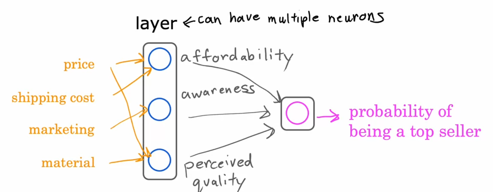
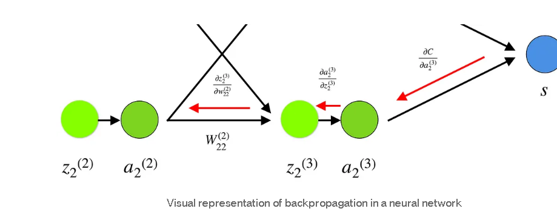
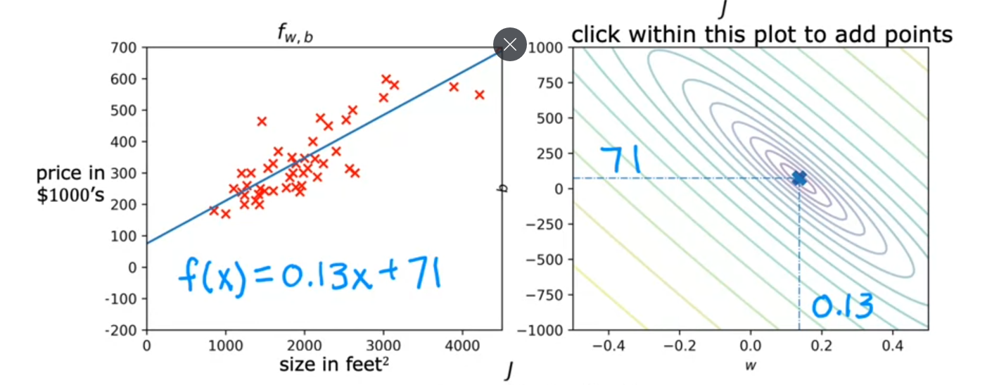
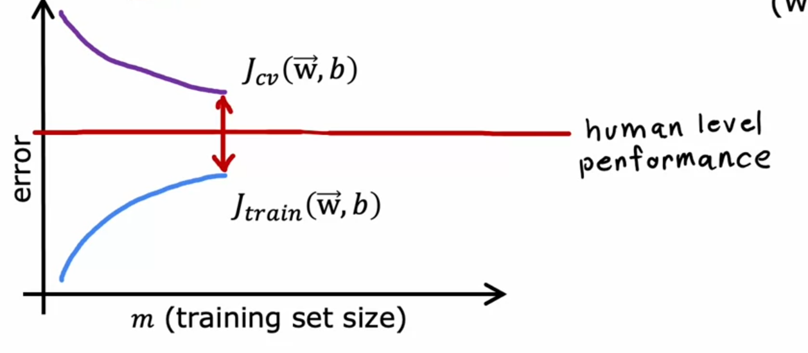
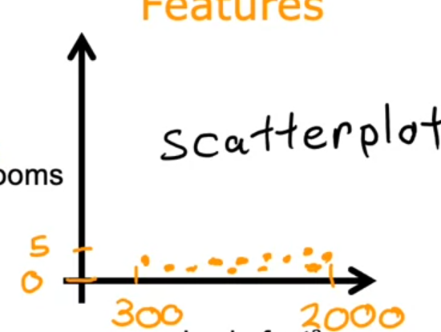
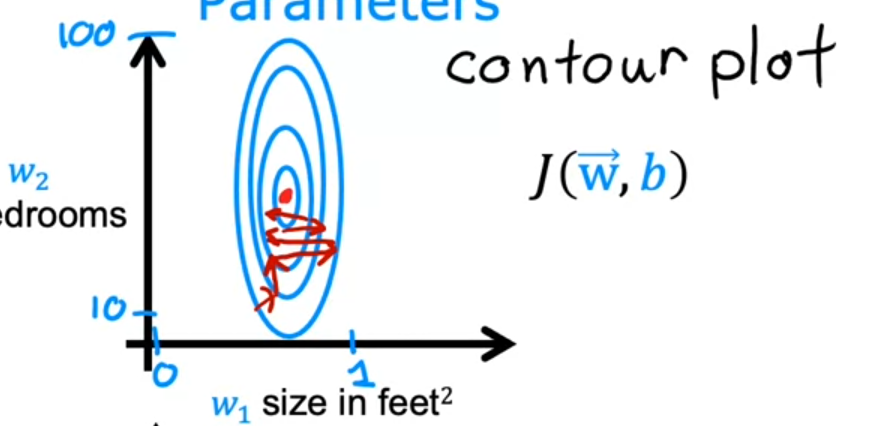
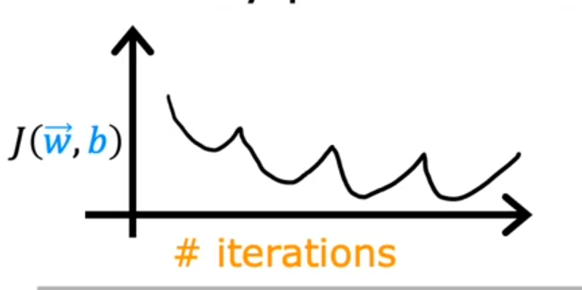
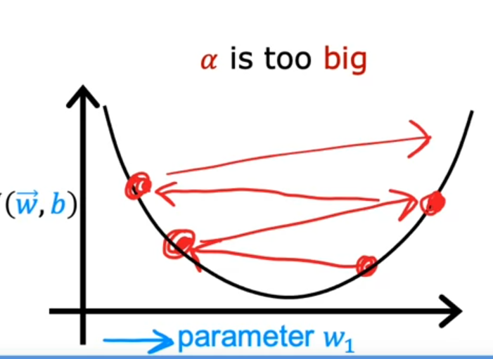

# Machine Learning

>Field of study that gives computers the ability to learn withut being explicitly programmed. 
-Arthur Samuel 

+ Supervised Learning
The purpose of this way of learning is to given certain inputs, take them to obtain an output through algorithms. "Learn from right answers"
    1. Regression: Predict a number through infinitely many possible outputs. 
    2. Classification: predict discrete outputs (classes-categories), the most common has 2 possible outputs: 1 or 0. 
+ Unsupervised Learning
The data is given, but yet not classificated or labeled. The objective is to find something interesting in unlabeled data.  ** Algorithm has to find structure in the data **.

    1. Clustering (ex: Google News,DNA microarray): groups of data elements according to their similarity features.

*Steps*

    + Dimensionality Reduction: compress data using 
    + Dimensionality Reduction: compress data
    + Anomaly Detection: Find unusual 

+ Recommender systems
+ Reinforcement learning

___

    <b>
        <h2>
        Supervised Learning
        </h2>
    </b>

Training set -> Learning Algorithm -> Hypothesis function  (model)

Univariate linear regression 

Multivariate regression

<strong>

Linear Regression

</strong>

### Cost function 

$$
J(w,b) = \frac{1}{2m} \sum _{i=1} ^{m} (f_{w,b}(x^{i})-y^{(i)})^2 
$$
$$
f_{w,b}(x^{(i)})=w x^{i} + b
$$

### Cost function intuiton

It's choosed a "w,b" such that minimizes J(w,b)-> Error function. 

+ contour graph

It shows the center points that have the same value J, but different values on w,b.
It takes horizontal sizes, those are the elipses.

The error minimizes when the cost function is near or in the global minimum.
The cost function can be convex, which indicates that the cost function has a global mininum.
___

### Multiple features

It not the same that multivariable regression 
$$
f_{\vec{w},b}(x)=w_1 x_1 + w_2 x_2 + w_3 x_3 + w_n x_n + b... = \vec{w} \cdot \vec{x} +b
$$

### Vectorization

$\vec{w}=[w_{1} w_{2} w_{3}]$ 

In python (simpler,faster) with numpy uses parallel hardware:

    f= np.dot(w,x) + b

### Gradient descent in multiple features (n)

$$
w_{j} = w_{j} - \alpha \frac{1}{m} \sum _{i=1} ^{m} (f_{\vec{w},b}(\vec{x}^{(i)})-y^{(i)})x_{j}^{(i)}
$$

$$
b = b - \alpha \frac{1}{m} \sum _{i=1} ^{m} (f_{\vec{w},b}(\vec{x}^{(i)})-y^{(i)})x_{j}^{(i)}
$$

An alternative to gradient descent:

* Normal equation : only for linear regression, slow.

___

### Feature size and gradient descent

Features

Parameters (Contour graph)

<strong>Feature Scaling</strong>

* Max Normalization
$x = \frac{x}{max(x)}$

* Mean Normalization
$x =\frac{x - \mu}{max(x)-min(x)}$

* Z-score Normalization
$x=\frac{x-\mu}{\sigma}$

<strong>Checking descent for convergance</strong>

Objective function: $$min_{w,b}  J(\vec{w},b)$$

When $\alpha$ is tiny :

When $\alpha$ is big :

Recommended method : increase x3, then by decade.

### Feature Engineering

$$f_{\vec{w},b}=w_{1}x_{1}+w_{2}x_{2}+w_{3}x_{3}$$
Creating a new variable $x_{3}=x_{1}x_{2}$

___

### Cost Function

$$ 
    f_{(\vec{w},b)} =\frac{1}{1+e^{-(\vec{w} \cdot \vec{x} + b)}}
$$
The cost function from this logistic function is not convex (multiple minimums), hence it could not be used.
$$J(\vec{w},b) =\frac{1}{m} \sum _{i=1} ^{m} (f(\vec{x^{(i)}})-y^{(i)})^2$$

Logistic Loss function:

$$L\left(f_{\vec{w},b}\left(\vec{x}^{(i)}\right), y^{(i)}\right) = \begin{cases}
-\log\left(f_{\vec{w},b}\left(\vec{x}^{(i)}\right)\right) & \text{if } y^{(i)} = 1 \\
-\log\left(1-f_{\vec{w},b}\left(\vec{x}^{(i)}\right)\right) & \text{if } y^{(i)} = 0
\end{cases}$$

* Clasification 

* Regressions

The cost previous cost function is not linear, the simplified cost function does:
$$L(f_{\vec{w},b}(\vec{x}^{(i)}), y^{(i)}) = -y^{(i)} \log(f_{\vec{w},b}(\vec{x}^{(i)})) - (1 - y^{(i)}) \log(1 - f_{\vec{w},b}(\vec{x}^{(i)}))
$$

$$
J(\vec{w}, b) = \frac{1}{m} \sum_{i=1}^{m} \left[ L\left(f_{\vec{w},b}\left(\vec{x}^{(i)}\right), y^{(i)}\right) \right]
$$

### Gradient descent for logistic regression

Simultaneous updates like the linear regression, same concepts:

* Gradient Descent
* Vectorized Implementation
* Feature scaling

### Problems

* Overfitting

* Underfitting

Through Regulatization is possible to reduce the size of parameters $w_j$:

$$wrong: f(x)=28x - 385 x^{2}+39x^{3}-174x^{4}+100 (big values for w_{j})$$
$$good: f(x)= 13x-0.23x^{2} + 0.00014x^{3}-0.001 x^{4} +10 (small values for w_{j})$$

Solutions to overfitting:

collect more data, select features, reduce size of parameters. When regularizing, a terms are added to the cost function:

To regularize w terms, the term is $\frac{\lambda}{2m} \sum _{j=1}^{n} w_{j}$

To regularize b , the term is $\frac{\lambda}{2m} b^{2}$

being $\lambda >0$, it means the relative "trade-off".

### Gradient descent with regularization

$$w_{j}=\boxed{ w_{j} - \alpha \frac{\lambda w_{j}}{m} }- \alpha \frac{1}{m} \sum _{i=1} ^{m}(f_{\vec{b},b}(\vec{x}^{(i)}-y^{(i)})) x_{j}^{(i)}$$